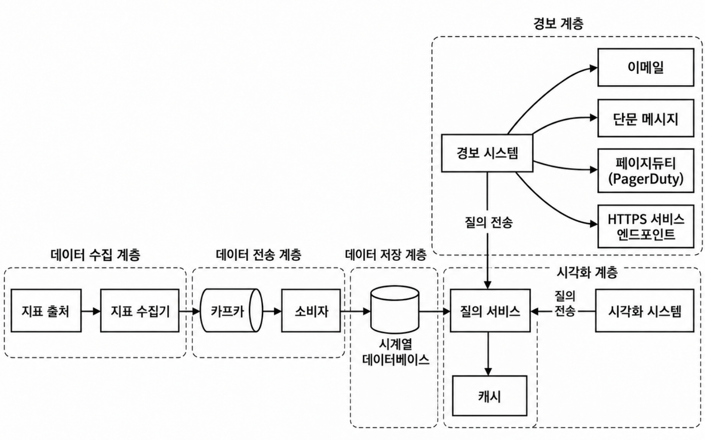
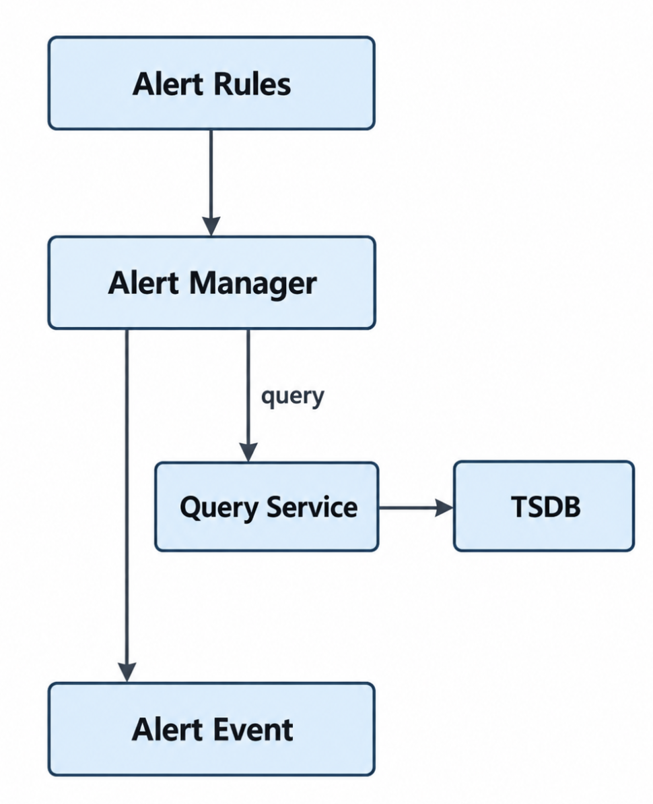

## 모니터링은 왜 해야하는가?
서버가 살아있어도, 이런 문제는 생긴다
- 요청이 계속해서 실패하고
- 레이턴시가 높고
- 디비 커넥션 풀이 바닥을 치고
- 특정 지역의 사용자들만 문제를 겪기도 한다

모니터링은, 시스템 내부의 상태를 관측가능한 숫자로 보여주는 것이다

모니터링을 도입하는 개발자가 가장 무서웠던 건 이런것이었을 것이다:
- "흠. 뭔가 느린 거 같은데 왜 느린거지?"
느린 것을 감지하였는데(감지라도 하면 다행) 이것의 원인을 모른다면 개발자는 뭘 할 수 있는가? 
그래서 이것을 알기 위해서는 요청량, 오류 발생률, p95레이턴시, cpu/memory... 이런것들은 숫자로 남아야한다.

그런데 이같은 시계열 데이터들을 초단위, 분단위로 모으다보면 그 데이터의 수만해도 시스템을 압도할 것이다.

그래서 이번 챕터에서는 어떻게하면 그 압도되는 수의 데이터를 나를 것이냐? 를 다룬다

### 아키텍쳐


모니터링 시스템엔 다섯개의 컴포넌트(계층)가 있다.
*먼저, 여기에서 다룰 데이터 모델은 시계열 데이터이다

## 1. 데이터 수집
지표 출처란 서버일 수도 있고, 디비일 수도 있고 다양하다.
지표 출처에서 수집기로 지표를 보내는 방법에는 풀모델, 푸시모델이 있다. (정답은 없다)

그리고 모든 지표가 그런것은 아니나 예를들어 cpu 사용량 이런 데이터는 조금 잃어도 괜찮은 경우가 많다. 그래서 보통 at most once방식을 쓴다 (처리량 늘리려고)

- **pull 모델**
	- 수집기가 출처의 엔드포인트 호출해서 서버에 쌓인 메트릭들 갖고오는거
	- 출처가 한대가 아니라 여러개면 수집기는 이런걸 알아야한다
		- 어떤 출처가 존재하는지
		- 이번엔 어디로 요청을 보내야하는지
		- 등의 설정들
	- 그래서 카프카에서 봤던, 주키퍼 같은 service discovery 도구를 쓴다
	- 그런데 수집기 한대로 부하 감당이 안되는 경우라면 출처 뿐만 아니라, 수집기도 여러대일 필요가 있다.
	- 그 경우 consitent hashring 써서 각 수집기가 담당하는 출처를 정의한다
	- 그래서 풀모델은 이렇게 수집기가 서버를 알기위한 장치가 필요하단 것이 단점이지만, 반대로 이것이 서버의 장애를 감지하기 쉽게 만드는 의도 외의 장점도 있다
- **push 모델**
	- 수집기는 출처를 모른다. 출처가 수집기에 열린 입구로 알아서 자신의 메트릭을 보낸다
	- 이 경우, 수집하는 에이전트(모듈같은거)를 만들어 출처에 붙여야한다
	- 출처가 보내고싶을떄만 보내니깐 어느정도 모아서 보내기가 가능하다 (효율적)
	- 대신 많은 출처에서 수집기의 현재 상태를 모른채로 보내기에 수집기가 순간 부하에 걸릴 위험이 존재한다 -> 그래서 애는 풀모델과 반대로, 출처->수집기로 갈때 로드밸런싱을 한다고 함 (당연히 오토스케일링을 하기도 하고)

> 데이터의 reliability 측면에서, 푸시/풀 모델 중 어느 쪽이 본질적으로 데이터 유실에 강하다고 보기는 어렵다. 풀은 수집 주기 사이의 순간적인 상태 변화를 놓칠 수 있고, 푸시는 전송 실패 시 버퍼와 재시도가 없다면 데이터를 잃을 수 있다.


## 2. 데이터 전송
수집은 어딘가에 잘 모아뒀고, 수집한 데이터를 타임시리즈 디비(tsdb)에 잘 옮겨야한다. 이것을 수행하는게 전송 컴포넌트다. 

가장 단순하게는, 전송 컴포넌트를 무시하고 수집기에서 바로 tsdb로 넘기면 마음이 편하다. 그런데 이 경우 이런 문제가 존재한다
- 수집 속도와 저장 속도를 독립적으로 확장하기가 어렵다
- 순간적인 트래픽 폭증이 tsdb가 그대로 맞게된다
- - tsdb가 죽으면 갈곳없는 데이터가 생긴다
- tsdb에 부하가 몰려 write에 레이턴시가 생기면 수집기도 느려진다 (음. 근데 코루틴같은거 쓰면 극복가능하긴 하겠네)

그래서 가장 이상적인 구조로서 수집계층과 저장계층 사이에 전송계층을 두기로 한 것이다

이거 하기 가장 만만한게 카프카인 것이다


## 3. 데이터 저장
이 시스템의 데이터는 특이하다
- write가 지속적이며 압도적으로 많고, read는 spiky하다
- '최근 1시간' 같은 시간 구간 기반 집계를 자주 한다

그래서 관계형 디비에 넣으면 뭐가 문제냐면
- 지속적인 대량 write 환경에 맞게 튜닝해야하고
- 시계열 연산을 sql로 표현하기가 어렵고
- 데이터 보존/집계를 직접 구현해야함
그래서 저자는, 이런 범용적인 관계형 디비를 억지로 튜닝하기보다 잘 만들어진 tsdb를 쓰라고 하는 것이다 (eg. influxDB, prometheus)

이것들은 시계열 질의, 레이블 기반 조회를 잘 처리한다고 한다.

하지만, 데이터가 너무 많다. 데이터를 줄일수 있는 방안이 필요하다.

이러한 메트릭의 특징 중 하나는 "오래될수록 덜 중요해진다"라는 건데, 즉 오래된 시간에 대해서는 해상도를 낮춤으로써 데이터 크기를 압축할 수 있단 것이다 (=downsampling)

그걸 넘어서 너무 오래되어 거의 조회되지 않는 상태에 이르렀다면 cold 저장소로 보내 저장 비용을 더 낮춘다


## 4. 질의 서비스
지금까지 데이터를 잘 모았고, 잘 저장해두었다. 이제는 그 데이터를 누가 읽냐이다
대표적으로 두개이다
- 경보
- 시각화

책에선, 경보/시각화 계층에서 tsdb에 데이터를 갖고오게 하기 위해 질의 서비스라는 별도 서비스를 둔다. 

근데 그냥 대시보드와 경보 시스템이 tsdb를 바로 읽으면 안되는 것인가? 왜 비용을 늘려가며 서비스를 하나 더 띄우는 것일까?

-> 결국 추상화를 하고 싶었던 것이다. 
- 클라이언트들이 tsdb 구현에 의존하지 않게하기 위해서
- 저장소를 바꾸더라도 질의 서비스만 바라보게 하고 싶어서

즉, 인터페이스 두어 계층간 결합도를 낮추려는 것이다
근데 돈 없으면 안둬도 되긴할듯


## 5. 시각화
이건 직접 만들 필요가 없다. 고품질의 시각화 시스템은 만들기가 어려울 뿐더러
이미 grafana 좋은 것들이 너무 많아서 굳이 새로 만들 이유가 없기 때문이다
-> 하지만 만약 우리가 돈없는 팀이고 정교한 모니터링이 필요한 팀이 아니라면, 서버를 새로 띄우지 않고 기존 서버에 통합시키기 위해 직접 만드는건 꽤 합리적인거같다

## 6. 경보
핵심 목적은 이상을 알려주는 것이 아니라, 사람이 조치해야할 이상을 놓치지 않고 전달함에 있다.

그런데 겉보기에 간단해보이는 시스템인데, 여기서도 꽤 많은 결합도 낮추기가 존재한다



- alert rules: (보통) yaml 꼴로 적는 어떤 경보를 언제 어떻게 받고 싶다라는 규칙문서이다
- alert manager가 룰 기반으로 질의 서비스에 데이터를 요청하고, 그걸 기반으로 경보 이벤트를 발행한다.
- alert manger는 이것 외에, 중복된 경보를 보내지 않게하고 보내지않아도되는 경보를 제거하고 경보 규칙에 접근 제한을 두는 등, 연결된 서비스에 대한 전반적인 책임을 갖고있는 중앙 시스템이다


경보는 단순한 메시지성 이벤트가 아니라 상태를 가져야하는 데이터이다
현재 어떤 경보가 발생했고, 어떤 경보가 개발자에게 전달이 됐고 어떤 경보가 해결되었는지를 알아야하기 떄문이다

그래서, 별도의 경보 저장소가 있는것이 이상한것이 아니다 (보통 키밸류 스토어)

또한, 경보 event를 발행하는 것과 실제 알림의 전송을 분리하는 것도 바람직하다.
알림의 전송은 이메일로 가거나, 슬랙으로 가거나 할텐데 이렇게 외부와 결합된 시스템은 mq(카프카 등)를 활용하여 떼어내는것이 바람직할 것이다

그런데 이것도 사실, 시각화 도구처럼 잘 만들기가 복잡하고 pager duty같은 이미 완성도가 높은 검증된 도구가 이미있다


-----

## Appendix 1. Prometheus + Grafana

지금까지는 모니터링 시스템을 직접 설계한다고 가정했다.

그런데 실무에서는 이 컴포넌트들을 전부 직접 만들기보다, **Prometheus + Grafana** 조합을 많이 사용한다. 특히 Kubernetes / microservice 환경에서 대표적인 metrics monitoring 조합이다. Grafana 역시 Prometheus를 대표적인 cloud-native metrics backend로 설명하고 있으며, Prometheus data source를 기본 지원한다. ([Grafana Labs](https://grafana.com/docs/grafana/latest/datasources/prometheus/?utm_source=chatgpt.com "Prometheus data source | Grafana documentation"))

대략 책의 아키텍처와 대응시키면 다음과 같다.

```text
[Application / DB / Server]
          │
      /metrics
          │
          ▼
     Prometheus
   ┌───────────────┐
   │ Collector     │
   │ TSDB          │
   │ Query Engine  │
   │ Rule Engine   │
   └──────┬────────┘
          │
      PromQL query
          │
          ▼
       Grafana
      Dashboard
```

즉 책에서는:

```text
Collector
   ↓
Kafka
   ↓
Consumer
   ↓
TSDB
   ↓
Query Service
```

처럼 여러 컴포넌트로 분리했지만, **기본적인 Prometheus는 상당 부분을 하나의 서버 안에서 해결한다.**

Prometheus는 target의 metric endpoint를 HTTP로 **Pull(scrape)***하고, 이를 자체 TSDB에 시계열 데이터로 저장한다. target 목록은 static configuration이나 service discovery를 통해 알아낼 수 있다. ([Prometheus](https://prometheus.io/docs/introduction/overview/?utm_source=chatgpt.com "Overview | Prometheus"))

```text
Service Discovery
       ↓
Prometheus
       │ pull
       ├────→ Server A /metrics
       ├────→ Server B /metrics
       └────→ Server C /metrics
```

그래서 우리가 앞에서 설계했던:

```text
Pull Model
+
Service Discovery
+
Collector
+
TSDB
```

를 Prometheus 하나가 상당 부분 구현하고 있다고 생각하면 된다.

### PromQL

저장된 데이터를 질의할 때는 **PromQL(Prometheus Query Language)***을 쓴다.

예를 들어 개념적으로:

```text
지난 5분 요청률
특정 service의 error rate
p95 latency
```

같은 시계열 연산을 PromQL로 표현한다.

즉 앞서 설계했던 **Query Service 역할 중 상당 부분을 Prometheus 자체 query API와 PromQL이 담당한다.**Prometheus는 metric name과 key-value label을 기반으로 한 다차원 시계열 모델을 사용한다. ([Prometheus](https://prometheus.io/docs/introduction/overview/?utm_source=chatgpt.com "Overview | Prometheus"))

---

### Grafana

Prometheus가 데이터를 **모으고 저장하고 질의하는 놈**이라면,

Grafana는 그 데이터를 **사람에게 보여주는 놈**이라고 보면 된다.

```text
Prometheus
    ↑
  PromQL
    │
 Grafana
    │
    ▼
Dashboard
```

Grafana에 Prometheus를 data source로 등록하면 Grafana가 Prometheus API를 통해 데이터를 조회하고 그래프와 dashboard를 만든다. Prometheus data source는 Grafana에 기본 지원된다. ([Grafana Labs](https://grafana.com/docs/grafana/latest/datasources/prometheus/?utm_source=chatgpt.com "Prometheus data source | Grafana documentation"))

그래서 가장 단순하게 외우면:

> **Prometheus = 수집 + 저장 + 질의**  
> **Grafana = 시각화**

이다.

---

### 그럼 경보는?

Prometheus에는 **alerting rule**도 있다.

```text
Prometheus
  │
  │ alerting rule 만족
  ▼
Alertmanager
  │
  ├── Email
  ├── Slack
  └── PagerDuty ...
```

여기서 역할이 꽤 명확하게 나뉜다.

**Prometheus**

> "이 metric이 조건을 위반했다."

를 판정한다.

**Alertmanager**

> "그 alert를 누구에게, 어떤 방식으로 보낼 것인가?"

를 담당한다.

Alertmanager는 alert의 **grouping, silencing, inhibition, notification*전달**을 담당한다. ([Prometheus](https://prometheus.io/docs/alerting/latest/overview/?utm_source=chatgpt.com "Alerting overview | Prometheus"))

이건 앞에서 책에서 설계한 구조와 꽤 비슷하다.

```text
책

Alert Rules
    ↓
Alert Manager
    ↓
Kafka
    ↓
Email / PagerDuty
```

현실의 Prometheus 생태계에서는 대략:

```text
Prometheus Alerting Rules
          ↓
      Alertmanager
          ↓
Email / Slack / PagerDuty
```

가 된다.

---

### Push는 못 하나?

Prometheus의 기본 철학은 **Pull**이다.

하지만 short-lived batch job처럼 Prometheus가 scrape하기 전에 프로세스가 사라질 수 있는 경우에는 **Pushgateway**라는 중간 컴포넌트를 사용할 수 있다. ([Prometheus](https://prometheus.io/docs/introduction/overview/?utm_source=chatgpt.com "Overview | Prometheus"))

```text
Short-lived Job
      │ push
      ▼
 Pushgateway
      ▲
      │ pull
 Prometheus
```

즉 Prometheus가 push 모델로 바뀌는 게 아니라,

> **job → Pushgateway는 push, Prometheus → Pushgateway는*여전히 pull**

이다.

---

### 책의 설계와 다른 점

책은 **초대규모 범용 metrics monitoring platform**을 설계하기 때문에:

```text
Collector
↓
Kafka
↓
Consumer
↓
Distributed TSDB
```

처럼 각 계층을 분리해서 확장한다.

반면 기본 Prometheus는:

```text
Scraping
Storage
Query
Rule evaluation
```

을 상당 부분 **하나의 Prometheus server에서 해결한다.**

Prometheus 공식 문서도 각 서버가 독립적으로 동작하며 기본적으로 distributed storage에 의존하지 않는 구조라고 설명한다. ([Prometheus](https://prometheus.io/docs/introduction/overview/?utm_source=chatgpt.com "Overview | Prometheus"))

그래서:

> **책의 설계 = 대규모 monitoring platform 자체를 만든다면 어떻게 설계할 것인가**  
> **Prometheus + Grafana = 이미 잘 구현된 컴포넌트를 가져다가 monitoring system을 구성하는 아주 현실적인 방법**

이라고 생각하면 된다.

그리고 규모가 더 커져 Prometheus 한 대의 저장/조회 능력을 넘어가면 **Thanos, Grafana Mimir*같은 Prometheus-compatible backend**를 붙여 장기 보관과 수평 확장을 해결하는 식으로 발전한다. Grafana도 Prometheus data source를 통해 Mimir와 Thanos 같은 Prometheus API 호환 backend를 지원한다. ([Grafana Labs](https://grafana.com/docs/grafana/latest/datasources/prometheus/?utm_source=chatgpt.com "Prometheus data source | Grafana documentation"))


## Appendix 2. 작은 AWS 환경에서는? — CloudWatch

AWS를 쓰고 있다면 앞에서 설계한 시스템의 상당 부분을 **CloudWatch**가 관리형 서비스로 대신해준다.

특히 EC2, RDS, ELB 같은 AWS 서비스들은 기본적인 metric을 CloudWatch로 직접 publish한다. 따라서 사용자가 직접 `수집기 → Kafka → TSDB`를 구축하지 않아도 된다. ([AWS Documentation](https://docs.aws.amazon.com/AmazonCloudWatch/latest/monitoring/working_with_metrics.html?utm_source=chatgpt.com "Metrics in Amazon CloudWatch - Amazon CloudWatch"))

대략 이렇게 대응시킬 수 있다.

```text
[EC2 / RDS / ELB ...]
         │
         │ AWS가 기본 metric 전송
         ▼
┌───────────────────────────┐
│       CloudWatch          │
│                           │
│  Metrics 저장             │
│  Query                    │
│  Dashboard                │
│  Alarm                    │
└───────────┬───────────────┘
            │
         Alarm
            ▼
           SNS
       ┌────┼────┐
       ▼    ▼    ▼
     Email ...  다른 시스템
```

즉 책에서는:

```text
Collector
  ↓
Kafka
  ↓
Consumer
  ↓
TSDB
  ↓
Query Service
  ↓
Dashboard / Alert
```

를 직접 설계했지만,

> **AWS에서는 그 상당 부분을 CloudWatch라는 managed service 뒤에 숨겨버린 셈이다.**

우리는 CloudWatch 내부에서 Kafka를 몇 대 쓰는지, TSDB를 어떻게 shard하는지 알 필요가 없다.

---

### 1. 데이터 수집

AWS 서비스 자체에서 제공하는 metric은 별도의 agent조차 필요하지 않은 경우가 많다.

예를 들어 EC2는 기본적으로 CPU, Network 등의 metric을 CloudWatch에 제공한다. 기본 모니터링은 5분 단위이고, detailed monitoring을 사용하면 1분 단위 metric을 받을 수 있다. ([AWS Documentation](https://docs.aws.amazon.com/prescriptive-guidance/latest/implementing-logging-monitoring-cloudwatch/configuring-cloud-watch-for-ec2-instances-and-on-premises-servers.html?utm_source=chatgpt.com "Configuring CloudWatch for EC2 instances and on-premises servers - AWS Prescriptive Guidance"))

```text
EC2
 │
 │ 자동
 ▼
CloudWatch
```

그런데 EC2 안쪽의 모든 정보가 AWS에 보이는 것은 아니다.

대표적으로:

```text
CPU usage       → AWS가 알 수 있음
Network         → AWS가 알 수 있음

Memory usage    → VM 안을 봐야 함
Disk usage      → VM 안을 봐야 함
Application metric → 당연히 애플리케이션만 앎
```

이럴 때 **CloudWatch Agent**를 서버에 설치한다.

```text
EC2
 │
CloudWatch Agent
 │
 ▼
CloudWatch
```

Agent는 EC2뿐 아니라 온프레미스 서버에서도 system metric을 수집할 수 있고, custom metric도 보낼 수 있다. ([AWS Documentation](https://docs.aws.amazon.com/en_en/AmazonCloudWatch/latest/monitoring/Install-CloudWatch-Agent.html?utm_source=chatgpt.com "Collect metrics, logs, and traces using the CloudWatch agent - Amazon CloudWatch"))

따라서 책에서 본 **Push model의 agent**와 매우 비슷하다.

Custom metric은 애플리케이션에서 CloudWatch API나 OpenTelemetry 등을 통해 직접 publish할 수도 있다. AWS의 현재 문서는 OpenTelemetry 기반 ingestion도 지원한다. ([AWS Documentation](https://docs.aws.amazon.com/AmazonCloudWatch/latest/monitoring/working_with_metrics.html?utm_source=chatgpt.com "Metrics in Amazon CloudWatch - Amazon CloudWatch"))

---

### 2. 데이터 모델

CloudWatch에서도 기본 개념은 똑같다.

```text
Namespace
Metric Name
Dimensions
Timestamp
Value
```

예:

```text
Namespace   = AWS/EC2
Metric      = CPUUtilization
Dimension   = InstanceId=i-1234
Value       = 73%
```

여기서 `Dimensions`가 우리가 앞에서 봤던 **label/tag**와 거의 같은 역할을 한다. CloudWatch는 namespace와 dimension 조합을 이용해 metric을 구분한다. ([AWS Documentation](https://docs.aws.amazon.com/AmazonCloudWatch/latest/monitoring/cloudwatch_concepts.html?utm_source=chatgpt.com "Metrics concepts - Amazon CloudWatch"))

---

### 3. 데이터 저장

사용자 입장에서는 TSDB를 직접 운영하지 않는다.

```text
Metric
  ↓
CloudWatch
```

하면 AWS가 저장을 책임진다.

재미있는 점은 앞에서 공부했던 **downsampling을 CloudWatch가 실제로 해준다**는 것이다.

CloudWatch의 metric retention은 현재 다음과 같다.

```text
< 60초 고해상도 데이터
    ↓ 3시간 후

1분 단위
    ↓ 15일 후

5분 단위
    ↓ 63일 후

1시간 단위
    ↓
최대 15개월 보관
```

즉 시간이 오래될수록 해상도를 낮춘다. ([AWS Documentation](https://docs.aws.amazon.com/prescriptive-guidance/latest/amazon-rds-monitoring-alerting/cloudwatch-namespaces.html?utm_source=chatgpt.com "Amazon CloudWatch namespaces - AWS Prescriptive Guidance"))

딱 우리가 앞에서 배운:

> **오래된 metric은 정밀도를 버리고 저장 비용을 줄인다.**

가 실제 상용 서비스에 적용된 사례다.

---

### 4. 질의 + 시각화

CloudWatch 자체에 metric 조회 기능과 Dashboard가 있다.

```text
CloudWatch Metrics
       ↓
CloudWatch Dashboard
```

AWS 서비스별 기본 dashboard도 제공하고, 원하는 metric들을 골라 custom dashboard를 만들 수도 있다. ([AWS Documentation](https://docs.aws.amazon.com/AmazonCloudWatch/latest/monitoring/GettingStarted.html?utm_source=chatgpt.com "Getting started with CloudWatch automatic dashboards - Amazon CloudWatch"))

따라서 작은 AWS 시스템이라면:

```text
Prometheus + Grafana
```

를 별도로 운영하지 않고 그냥

```text
CloudWatch
```

하나로 끝낼 수도 있다.

---

### 5. 경보

CloudWatch에는 **CloudWatch Alarm**이 있다.

예를 들어:

```text
CPUUtilization > 80%
5분 동안 지속
```

같은 규칙을 설정한다.

```text
CloudWatch Metric
       ↓
CloudWatch Alarm
       ↓
      SNS
       ↓
Email / 기타 시스템
```

Alarm은 metric이 threshold를 일정 기간 위반했는지 판단하고, 상태 변화가 발생하면 SNS notification이나 Auto Scaling 등의 action을 실행할 수 있다. ([AWS Documentation](https://docs.aws.amazon.com/AmazonCloudWatch/latest/monitoring/cloudwatch_concepts.html?utm_source=chatgpt.com "Metrics concepts - Amazon CloudWatch"))

그래서 책의 구조와 대응시키면:

```text
책
────────────────────
Alert Rule
   ↓
Alert Manager
   ↓
Alert Event
   ↓
Notification


AWS
────────────────────
CloudWatch Alarm
   ↓
SNS / EventBridge
   ↓
Notification / Action
```

가 된다.

특히 Alarm을 **Auto Scaling과 연결할 수 있다는 점**도 재밌다.

```text
CPU 높음
   ↓
Alarm
   ↓
Auto Scaling
   ↓
EC2 추가
```

즉 경보가 반드시 인간에게 가는 것만은 아니다. 시스템이 스스로 대응하게 만들 수도 있다. ([AWS Documentation](https://docs.aws.amazon.com/AmazonCloudWatch/latest/monitoring/alarm-actions.html?utm_source=chatgpt.com "Alarm actions - Amazon CloudWatch"))

---

### Prometheus + Grafana와 비교하면

```text
직접 구축
────────────────────────────
Application
 ↓
Prometheus
 ↓
Grafana
 +
Alertmanager


AWS
────────────────────────────
AWS Resources / Agent
 ↓
CloudWatch Metrics
 ├→ CloudWatch Dashboard
 └→ CloudWatch Alarm
       ↓
      SNS
```

가장 큰 차이는 **누가 운영하느냐**다.

Prometheus + Grafana는 우리가 모니터링 시스템을 구성하고 운영한다면,

CloudWatch는:

> **AWS가 수집·저장·조회·시각화·경보 인프라 상당 부분을 관리해주는 방식**

이다.

그래서 AWS만 쓰는 작은 시스템이라면 CloudWatch 하나로 꽤 많은 걸 해결할 수 있고, 반대로 복잡한 Kubernetes/멀티클라우드 환경이나 PromQL/Grafana 생태계가 필요하면 Prometheus 계열을 함께 사용할 수도 있다. CloudWatch Agent 자체도 현재 CloudWatch와 Amazon Managed Service for Prometheus 양쪽으로 metric을 보낼 수 있다. ([AWS Documentation](https://docs.aws.amazon.com/en_en/AmazonCloudWatch/latest/monitoring/Install-CloudWatch-Agent.html?utm_source=chatgpt.com "Collect metrics, logs, and traces using the CloudWatch agent - Amazon CloudWatch"))

한 줄로 정리하면:

> **책에서 우리가 직접 설계했던 모니터링 플랫폼을 AWS에서는 CloudWatch라는 관리형 서비스로 사서 쓴다고 생각하면 된다.**
