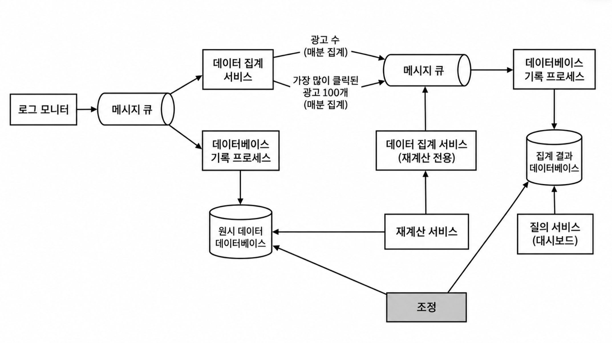
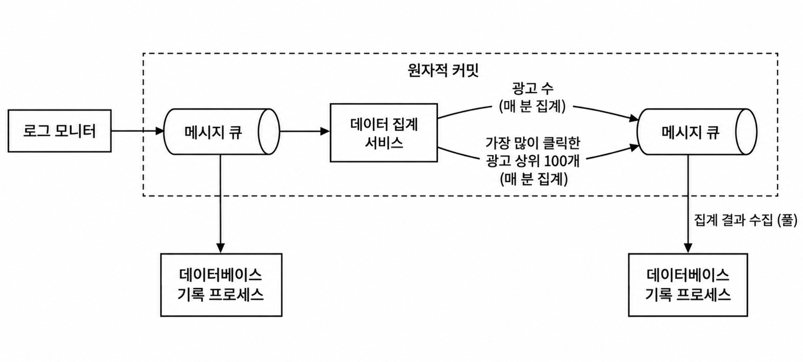
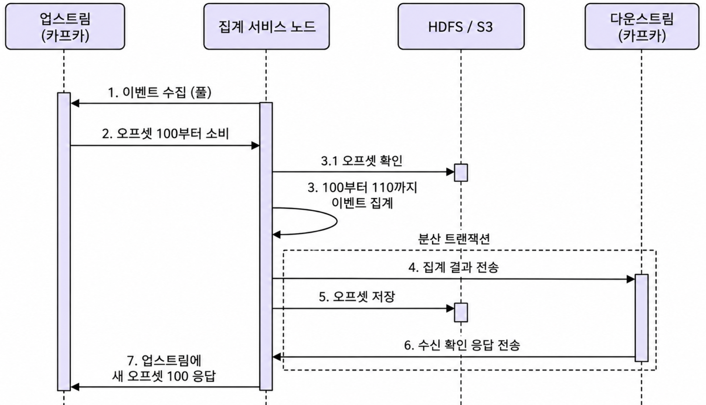
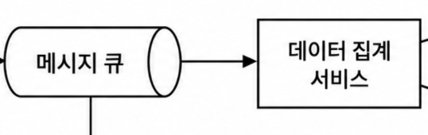
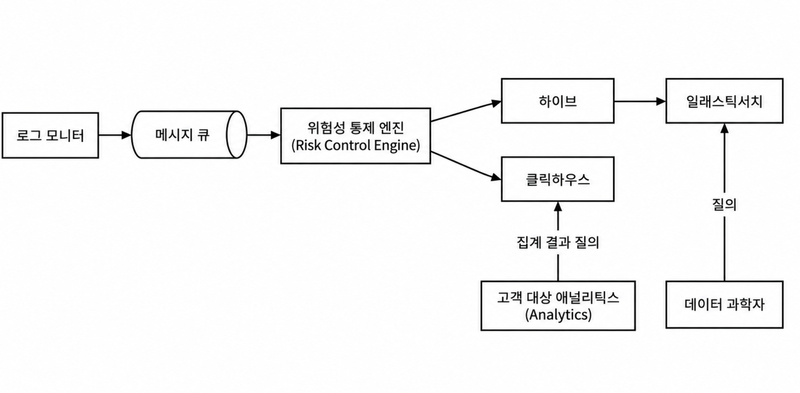

### 요구사항
1. 광고별로 최근 M분간 몇번이나 클릭됐는지 알고싶어요
2. 매분마다 많이 클릭된 상위 N개의 광고를 알고싶어요
3. 국가/지역 등의 조건으로 광고클릭수를 알고싶어요

### 왜 그룹바이 하면 안되는걸까
요구사항 1, 2, 3 모두 db에 그룹바이 한문장 추가해서 쿼리 떄리면 쉽게 구현이 가능하다
그런데 무슨 문제가 있을까?

배경 A. 클릭수가 아주 많다. 이 시스템을 유튜브급 서비스를 가정하고 있다

문제 A. 클릭수가 너무 많다. (write가 많음)
문제 B. 몇초 단위로 1,2,3이 지속 갱신되어야한다 (대규모 read가 많음)

### 이 문제에 대한 핵심적인 발상: 중복된 계산을 하지말자
- 조회 내용을 캐싱하는 것과는 별개로, 애초에 매 데이터(요구사항 1,2,3)를 갱신해야할 때 퍼포먼스 이슈가 발생한다
- 그런데 요구사항의 기능 특성을 곰곰이 생각해보면 새로운 데이터의 갱신값은 **직전의 갱신값을 부분 집합으로 가짐을 알 수 있다**
- 즉, 이 챕터를 관통하는 단일 목표는 "이미 계산된 부분 집합을 '기억'함으로써 다시 계산하지 말자"이다 
  (피보나치 수열에서 P1~P30을 알고싶을 때 P_x-2, p_x-1을 '기억'해두면 P1부터 다시 안해도 되는것과 같음)

### 또 등장하는 카프카
이전 챕터들에서도 거의 매번 카프카가 등장했다.
카프카가 쓰이는 건 주로
- 생산자와 소비자 결합을 끊기 위해
라고 보는게 타당하다

생산자, 저장소, 소비자 가 분리되어 서로의 구현을 몰라도 된다는 것은 소프트웨어적으로 엄청난 이점이다
이런것들을 얻을 수 있다
- 장애 격리
- 유량 제어: 소비자의 능력에 비해 생산자가 많게 만들어내도, 브로커에 잠깐 맡아둘 수가 있음
- 독립적인 확장이 가능
- 다른 특성의 소비자 추가하기가 쉬움: 예를들어 새로운 토픽의 데이터를 다뤄야하는 경우 새로운 소비자-생산자 프로토콜을 만들지 않아도 되고, 그냥 생산자는 카프카에 원래 하던대로 메시지 던지면 되고 소비자도 원래 하던대로, 오직 다른 토픽의 데이터를 컨슘하면됨
- 데이터 durability: 메시지를 디스크에 기록하며, 카프카 쓰는 규모의 시스템이라면 리플리카를 보통 두기 떄문에 생산자 혹은 소비자 프로세스가 뻑나도 데이터는 잘 살아있을 확률이 높음

### 메시지큐가 업스트림, 다운스트림 으로 두개 있다

raw데이터를 모으는 메시지큐가 하나있고, 집계된 결과를 모으는 메시지큐가 하나 더 있다.

여기서 원자적으로 하나로 묶고 싶은 논리는 이것이다
- 업스트림 큐에서 데이터를 가져와 집계 연산을 마치고, 다운스트림 큐에 데이터를 저장한다
> 크게보면 업스트림으로부터 컨슘하는 것과 다운스트림에 퍼블리싱하는걸 하나의 행위로 하고싶은 것이다.

이걸 왜 묶고 싶냐면, 다음을 보장하기 위해서이다
	- 하나의 클릭 이벤트 로그가 집계 결과에 정확히 한 번 영향을 준다

이것을 자세히보면 다음과 같다

업스트림 큐 관점에서 보면, 소비자가 소비했어도 오프셋 응답이 오지 않으면 그건 소비하지 않은 것이다
즉, 소비자가 소비한 뒤 다운스트림 큐에 퍼블리싱이 완료되고 나서야 오프셋 응답을 보내는 것이다.

저기서 (분산) 트랜잭션으로 묶인 영역이 중요한데, 위에서 봤던 원자적 커밋은 논리적인 트랜잭션인거고 실제로 물리적으론 이 그림 속 트랜잭션이 진짜 원자적으로 동작하는 행위들이다. 이것들만 원자적이 실제로 동작하더라도 업스트림에서 컨슘하는 것부터, 다운스트림에 퍼블리싱하는 것까지 논리적으로 원자적으로 동작한다고 볼수있기 때문이다. 

### 집계를 어떻게 할 것인가

집계 서비스가 고려해야할 것은 다음 두가지이다
- 데이터 묶음을 어떻게 긁어올 것인가
- 긁어온 데이터를 어떻게 계산할 것인가

먼저 데이터묶음을 긁어올 땐, window라는 개념을 쓸 것이다. 그냥 범위라는 개념을 구조화한 단어인데
요구사항을 보면 알수있듯, 그 범위의 시작과 끝은 시간이다.

데이터들이 가진 시간 속성은 두개가 있다.
- 이벤트가 생성된 시간
- 집계 서비스가 이벤트를 처리한 시간

비즈니스 맥락에 따라 답은 다르겠으나 여기선 이벤트의 생성시간 (유저가 실제로 클릭한 시간)이 합당할 것이다.

하지만 이벤트의 생성과 프로세싱이 항상 바로바로 되진 않을 것이다. 두 시간에 차이가 이벤트마다 다를 수 있단 것이다. 이때 이벤트 발생은 확인했으나 실제로 처리된 이벤트는 아직 확인하지 못하는 경우가 있을수있다

그래서 워터마크라는 걸 쓴다
- 1분 단위로 범위를 잘라서 집계할 때, t초만큼 범위를 연장하여 연장된 범위에 대해서 "1분 범위에 이벤트가 생성되었지만 1분 범위에 처리가 되진 않았지만 연장된 t초 범위에서 처리된 데이터"를 올바르게 얻어낼 수 있다.

이것이 만능은 아니다
- t가 크면 당연히 레이턴시가 늘어남
	- 적당한 숫자를 넣어야함
- 60+t 기간을 지나서 처리되는 데이터도 존재할 수 있음
	- 리스크의 피해가 적고 확률이 낮다면 과감히 포기해도 좋음. 마찬가지로 적당한 숫자를 넣어야함..

윈도우도 여기서 쓸만한건 두가지가 있다
- 텀블링 윈도우: 겹치지않는 구간 -> 매분 발생한 클릭수
- 슬라이딩 윈도우: 겹치는 구간 -> 지난 M분간 발생한 클릭수

이제 이렇게 데이터를 잘 긁어왔다면 어떻게 계산할것인가?
맵리듀스를 하면된다.

이건 꽤나 추상적인 개념인데, 결국 연산을 쪼개서 하잔건데 그 쪼개는 대상은 컴퓨터일수도있고 프로세스일수도있고 스레드일수도있다.

핵심은 한 주체가 모든 연산을 하지 않고, 쪼개면 리소스를 많이 쓸지언정 더 빨리끝낼수 있다 이다.

### 재계산 프로세스
데이터 집계 서비스가 중대한 버그가 있었어서 이미 집계했음에도 다시 집계해야하는 경우가 있다
"그냥 집계서비스가 다시 거기서부터 가져오면 안됨?"이 아니다.

하지만 집계서비스는 계속해서 다음 데이터를 받아서 처리해야한다
다시 되돌아가서 거기서부터 달리는건 시스템 전체에 중대한 장애를 야기할수있다

그래서 생각해낸건 "이럴땐 다른 애가 대신 좀 해주자"이다

이런 장애 발생 시엔 해당 윈도우의 프로세싱은 이미 늦은것이며, 안전하고 시스템 전체에 영향을 주지 않게끔 복구하는게 최우선 목표이다

그래서 별도의 재계산 서비스 (데이터집계서비스랑 동일하나, 다른 프로세스 혹은 컴퓨터임)를 두고 메시지 읽기도 메시지큐가 아니라, 디비에서 읽는다. (메시지큐는 이미 데이터집계서비스의 흐름에 따라 일하고있기에 방해하면 안됨) 그리고나서 똑같이 같은 다운스트림 큐에 넣는건 동일하다.

### 조정
앞서 윈도우에서 설명했듯, 간혹가다가 낮은 확률로 윈도우에서 벗어나서 데이터가 올바르게 처리되지 않을 수 있다.

아까 그것을 엄밀하게 다루지 않은 것은 그 데이터를 버려도된다는 의지가 아니라, 지금 당장 처리하기에는 roi가 낮고 나중에 누락된걸 처리해도 괜찮을거같다 이다.

그래서 조정 서비스가 존재한다
조정 서비스는 보통 이렇게 동작한다

주기적으로, 실제 원장 디비랑 집계결과 디비랑 비교하는 것이다. 이것은 무겁고 오래걸리는 일이지만 조정 자체는 실시간성이 필요한 것은 아니기에 충분한 조치이다

### 대안적 설계안: 이미 이거 잘하는 오픈소스들이 있다 

기존 설계는 클릭 이벤트가 들어오면 **집계 서버가 직접 계산해서 결과를 저장**하는 방식이었다.

대안 설계는 생각을 바꾼다.

> 원본 클릭 데이터를 충분히 저장해두고,  
> 검색은 검색에 강한 시스템에게, 집계는 집계에 강한 시스템에게 맡기자.

그래서 흐름이 이렇게 나뉜다.

- 클릭 이벤트는 Hive에 오래 보관한다. 나중에 과거 데이터를 다시 분석하거나 재처리할 수 있게 원본을 남겨두는 역할이다.
- 그런데 Hive는 빠른 검색용은 아니다. 그래서 특정 사용자, IP, 광고 같은 조건으로 데이터를 뒤져볼 필요가 있으면 Elasticsearch에 검색용 인덱스를 만들어둔다.
- 광고주가 보는 “최근 M분 클릭 수”, “Top N 광고”, “국가별 클릭 수” 같은 집계 결과는 ClickHouse가 빠르게 계산한다.

즉 이 설계의 핵심은:

> **원본은 Hive에 보관하고,  
> 원본 탐색은 Elasticsearch,  
> 실시간성 있는 집계 조회는 ClickHouse가 담당한다.**

기존안이 집계 로직을 우리가 직접 만든 설계라면, 대안은 전문 데이터 시스템들에게 역할을 분담시킨 설계다.
