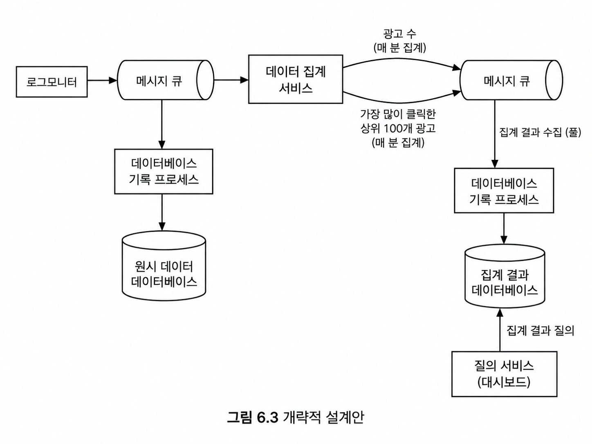
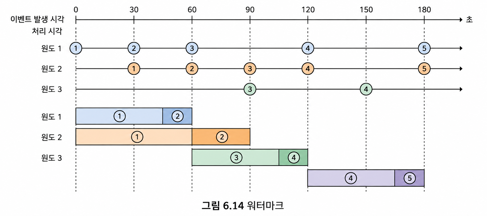
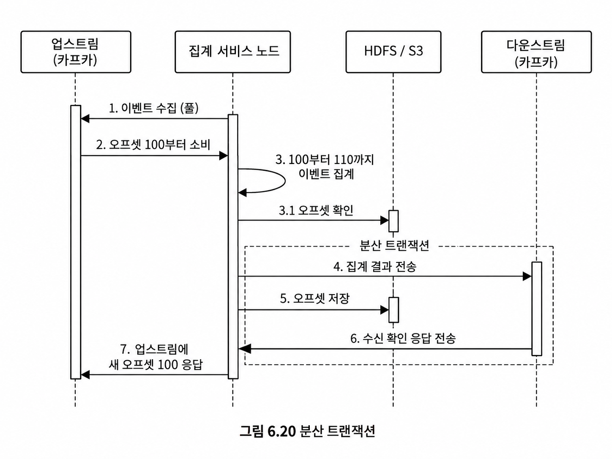

## 광고 클릭 이벤트 집계 시스템

실시간 데이터를 통해 광고 효과를 정량적으로 측정할 수 있다는 점 덕분에 온라인 광고의 비중은 날로 커지고 있다.

//

#### 기능 요구사항

M분 동안의 ad_id 클릭 수 집계
매분 가장 많이 클릭된 상위 100개 광고 아이디
다양한 속성에 따른 집계 필터링
대규모 데이터량

#### 비기능 요구사항

집계 결과의 정확성
지연, 중복 이벤트 적절히 처리
reliability(견고성): 부분적인 장애는 감내할 수 있어야 함
전체 처리 시간은 최대 수 분을 넘지 않아야 함

#### 규모 추정

DAU(일간 능동 사용자): 10억
사용자당 하루에 평균 1개 광고 클릭
광고 클릭 QPS = 10^9 / 10^5 = 10,000
최대 QPS는 5 × 10,000
광고 클릭 이벤트 하나당 0.1kb 용량
일일 요구량 = 10^9 × 0.1kb = 100gb / 월간 = 3TB

//

### 광고주 데이터 과학자를 위한 질의 API 설계

지난 M분 동안 각 ad_id에 발생한 클릭 수 집계
지난 M분 동안 가장 많은 클릭이 발생한 상위 N개 ad_id 목록
다양한 속성을 기준으로 집계 결과 필터링

원시 데이터 vs 집계 결과 데이터 보관
원시 데이터는 양이 너무 많아 집계 결과 자체를 따로 저장해야 한다.
원시 데이터도 문제 발생 시 디버깅에 활용할 수 있도록 따로 저장해 준다.

//

#### 데이터베이스 선정
쓰기 연산이 대부분이고, 사실상 시계열 데이터이므로 카산드라 or InfluxDB 사용.

//
### 비동기식 설계

메시지 큐를 도입함으로써 생산자와 소비자의 결합을 끊어 비동기식으로 설계한다.
장애 감내가 가능하고, 요소별 독립성을 바탕으로 규모 확장에 용이하다.

//

### 집계 서비스

대량의 데이터를 병렬 처리하기 위해 계산 모델 프레임워크인 MapReduce 사용: 분산 처리를 프레임워크로 쉽게 구현하기

입력 데이터 → MAP → Shuffle/Group By → REDUCE → 결과

시스템의 분산을 MapReduce가 해석할 수 있도록(어떤 작업이 어떤 작업에 의존하는지) DAG(유향 비순환 그래프)로 시스템을 표현해 준다.

맵 노드: 데이터 출처에서 읽은 데이터를 필터링하고 변환 (ad7, 1) (ad3, 1) (ad7, 1) (ad2, 1) (ad3, 1)집계 노드: ad_id별 광고 클릭 이벤트 수를 매분 메모리에서 집계 (ad7, [1, 1]) (ad3, [1, 1]) (ad2, [1])
리듀스 노드: 모든 집계 노드가 산출한 결과를 최종 결과로 축약 (ad7, 2) (ad3, 2) (ad2, 1)

사용 사례는 다음과 같다.

M분간 ad_id에 발생한 클릭 이벤트 수 집계 /
M분간 가장 많은 클릭이 발생한 상위 N개의 ad_id 집계 /
데이터 필터링

//

### 스트리밍 vs 일괄 처리

집계 서비스에 중대한 버그가 생겨, 버그 발생 시점부터 원시 데이터를 직접 읽어 집계 데이터를 재계산해야 하는 경우가 생길 것이다.

버그 발생 시점부터 해결되기 전까지의 원시 데이터이므로 일괄 처리 프로세스를 따른다.

메시지 큐에서 데이터 기록 프로세스 사이는 두 가지 시스템을 고려하게 되는데, 실시간으로 계산된 데이터는 스트리밍 시스템으로, 버그가 발생해 재계산된 데이터는 일괄 처리 시스템으로 처리해야 되는 지점이다.

람다는 동시에 두 가지를 지원한다. 다만 유지 관리해야 할 코드가 두 벌이라는 점이다.

카파 아키텍처는 단일 스트림 처리 엔진을 통해 실시간 데이터 처리 및 끊임없는 데이터 재처리 문제를 모두 해결한다.

따라서 카파 아키텍처 채택.

//

### 시간과 집계 윈도우

텀블링 윈도우는 시간을 같은 크기의 겹치지 않는 구간으로 분할하는 기법이다. 광고 클릭 이벤트 집계에 사용된다.

슬라이딩 윈도우는 특정 크기의 연속된 윈도우로 겹칠 수 있다. 지난 M분간 가장 많이 클릭된 상위 N개 광고 집계에 사용된다.

원시 데이터의 타임스탬프에 관해 두 가지 시간 개념이 있다.

이벤트 시각 : 광고 클릭이 실제로 발생한 시각
처리 시각 : 집계 서버가 클릭 이벤트를 처리한 시각

사용자가 광고를 클릭한 시점부터 서버에 도착하기까지의 시간 차이가 존재한다.

또 사용자마다 네트워크 환경이 다르므로 (A 이벤트 시각) < (B 이벤트 시각) && (A 처리 시각) > (B 처리 시각)인 상황도 존재한다.

데이터의 정확도가 중요하므로 이벤트 시각이 기준이 되어야 한다.

따라서 처리 시각 지연을 고려해 특정 시간 동안 윈도우를 열어 두는데, 이것이 워터마크이다.

워터마크가 5분이라면 window는 5분 동안 구간에 포함될 이벤트를 더 기다려 준다.

텀블링 윈도우 구간은 워터마크 길이만큼 겹치게 된다.

//

### 전달 보증

이벤트 집계에서 중복 방지를 위해 일반적인 최소 한 번보다, 정확히 한 번 방식을 사용한다.

카프카의 exactly-once를 넘어 집계 서비스까지 포함해서 설계할 필요가 있다.

서비스 노드가 주체가 되어야 하므로 HDFS/S3에 업스트림으로부터 받아 온 오프셋, 다운스트림으로 전달한 오프셋을 기록하여 장애 발생 시 중복을 방지한다.

4, 5, 6은 분산 트랜잭션으로 처리해, 중복 결과를 전송하는 것을 방지해 준다.

1~7을 트랜잭션으로 묶는 것은 무거우니 4~6만.

//

### 결함 내성

집계 서비스가 죽었을 때 빠르게 복구하는 방법에 대해 얘기한다.

그래서 Kafka를 두고 장애 지점부터 replay를 해 주는 것이다.

하지만 요구사항 중 지난 M분 동안 가장 많은 클릭이 발생한 상위 N개 ad_id 목록처럼 M분 크기의 윈도우를 채우려면 시간이 오래 걸릴 것이다.

그래서 주기적으로 시스템 상태를 스냅숏으로 저장하고, 마지막 스냅숏부터 replay하면 빠르게 복구가 가능하다.
